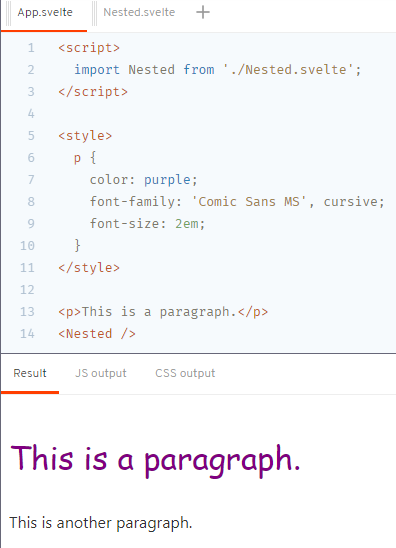

# Svelte Tutorial Notes

* [Introduction](#introduction)
    * [Adding Data](#adding-data)
    * [Dynamic Attributes](#dynamic-attributes)
    * [Styling](#styling)
    * [Nested Components](#nested-components)
    * [HTML Tags](#html-tags)
* [Reactivity](#reactivity)
    * [Assignments](#assignments)
    * [Declarations](#declarations)
    * [Statements](#statements)
    * [Updating Arrays and Objects](#updating-arrays-and-objects)
* [Props](#props)
    * [Default Values](#default-values)
    * [Spread Props](#spread-props)
* [Logic](#logic)
    * [if blocks](#if-blocks)
    * [else blocks](#else-blocks)
    * [else-if blocks](#else-if-blocks)
    * [each blocks](#each-blocks)
    * [Keyed each blocks](#keyed-each-blocks)
    * [await blocks](#await-blocks)
* [Events](#events)
    * [Inline Event Handlers](#inline-event-handlers)
    * [Event Modifiers](#event-modifiers)
    * [Component Events](#component-events)
    * [Event Forwarding](#event-forwarding)
    * [DOM Event Forwarding](#dom-event-forwarding)
* [Bindings](#bindings)
    * [Text Inputs](#text-inputs)
    * [Numeric Inputs](#numeric-inputs)
    * [Checkbox Inputs](#checkbox-inputs)
    * [Group Inputs](#group-inputs)
    * [Textarea Inputs](#textarea-inputs)
    * [Select Bindings](#select-bindings)
    * [Select Multiple](#select-multiple)
    * [Contenteditable Bindings](#contenteditable-bindings)
    * [Each Block Bindings](#each-block-bindings)
    * [Media Elements](#media-elements)
    * [Dimensions](#dimensions)
    * [This](#this)
    * [Component Bindings](#component-bindings)

## Introduction
[Back to Top](#svelte-tutorial-notes)

### Adding Data
[Back to Top](#svelte-tutorial-notes)

```svelte
<script>
  let name = 'world';
</script>

<h1>Hello {name}!</h1>
```

### Dynamic Attributes
[Back to Top](#svelte-tutorial-notes)

```svelte
<script>
  let src = 'tutorial/image.gif';
</script>


```

> or (if the property and attribute names are the same)

```svelte

```

### Styling
[Back to Top](#svelte-tutorial-notes)

```svelte
<style>
  p {
    color: purple;
    font-family: 'Comic Sans MS', cursive;
    font-size: 2em;
  }
</style>

<p>This is a paragraph.</p>
```

### Nested Components
[Back to Top](#svelte-tutorial-notes)

Styles do not leak between components.

```svelte
<script>
  import Nested from './Nested.svelte';
</script>

<style>
  p {
    color: purple;
    font-family: 'Comic Sans MS', cursive;
    font-size: 2em;
  }
</style>

<p>This is a paragraph.</p>
<Nested />
```

[](./images/nested-components.png)

### HTML Tags
[Back to Top](#svelte-tutorial-notes)

> Svelte doesn't perform sanitization before it inserts into the DOM. Manually escape HTML originating from sources you don't trust, otherwise you risk exposing users to XSS attacks.

```svelte
<script>
  let string = `this string contains some <strong>HTML!!!</strong>`;
</script>

<p>{@html string}</p>
```

## Reactivity
[Back to Top](#svelte-tutorial-notes)

Keep the DOM in sync with your application state using *reactivity*.

### Assignments
[Back to Top](#svelte-tutorial-notes)

```svelte
<script>
  let count = 0;

  function handleClick() {
    count += 1;
  }
</script>

<button>
  Clicked {count} { count === 1 ? 'time' : 'times' }
</button>
```

### Declarations
[Back to Top](#svelte-tutorial-notes)

Often, some parts of a component's state need to be computed from *other* parts, and recomputed whenever they change. THese are called *reactive declarations*.

```svelte
<script>
  let count = 0;
  $: doubled = count * 2;

  function handleClick() {
    count += 1;
  }
</script>

<button on:click={handleClick}>
  Clicked {count} { count === 1 ? 'time' : 'times' }
</button>
<p>{count} doubled is {doubled}</p>
```

### Statements
[Back to Top](#svelte-tutorial-notes)


```svelte
$: console.log(`the count is ${count}`);
```

Statements can be grouped with a block:

```svelte
$: {
  console.log(`the count is ${count}`);
  alert(`I SAID THE COUNT IS ${count}`);
}
```

You can put the `$:` in front of things like `if` blocks:

```svelte
$: if (count >= 10) {
  alert(`count is dangerously high!`);
  count = 9;
}
```

### Updating Arrays and Objects
[Back to Top](#svelte-tutorial-notes)

Because Svelte's reactivity is triggered by assignments, using array methods like `push` and `splice` won't automatically cause updates.

```svelte
function addNumber() {
  numbers.push(numbers.length + 1);
  numbers = numbers; // redundant assignment to trigger update
}
```

A better solution

```svelte
function addNumber() {
  numbers = [...numbers, numbers.length + 1];
}
```

> Similar patterns can be used to replace `pop`, `shift`, `unshift`, and `splice`.

A simple rule: The name of the updated variable must appear on the left hand side of the assignment.

```svelte
const foo = obj.foo;
foo.bar = 'baz';

obj = obj; // necessary to reflect updated foo
```

## Props
[Back to Top](#svelte-tutorial-notes)

In any real application, you'll need to pass data from one component down to its children. To do that, declare *properties*. This is done with the `export` keyword.

**Nested.svelte**  
```svelte
<script>
  export let answer;
</script>

<p>The answer is {answer}</p>
```

**App.svelte**  
```svelte
<script>
  import Nested from './Nested.svelte';
</script>

<Nested answer={42}>
```

### Default Values
[Back to Top](#svelte-tutorial-notes)

```svelte
<script>
  export let answer = 'a mystery';
</script>
```

### Spread Props
[Back to Top](#svelte-tutorial-notes)

If you have an object of properties, you can 'spread' them onto a component instead of specifying each one:

**Info.svelte**  
```svelte
<script>
  export let name;
  export let version;
  export let speed;
  export let website;
</script>

<p>
  The <code>{name}</code> package is {speed} fast.
  Download version {version} from <a href="https://www.npmjs.com/package/{name}">npm</a> and <a href={website}>learn more here</a>
</p>
```

## Logic
[Back to Top](#svelte-tutorial-notes)

HTML doesn't have a way to express *logic*, like conditionals and loops. Svelte does.

### if blocks
[Back to Top](#svelte-tutorial-notes)

```svelte
{#if user.loggedIn}
  <button on:click={toggle}>
    Log out
  </button>
{/if}

{#if !user.loggedIn}
  <button on:click={toggle}>
    Log in
  </button>
{/if}
```

### else Blocks
[Back to Top](#svelte-tutorial-notes)

```svelte
{#if user.loggedIn}
  <button on:click={toggle}>
    Log out
  </button>
{:else}
  <button on:click={toggle}>
    Log in
  </button>
{/if}
```

### else-if blocks
[Back to Top](#svelte-tutorial-notes)

```svelte
{#if x > 10}
  <p>{x} is greater than 10
{:else if 5 > x}
  <p>{x} is less than 5</p>
{:else}
  <p>{x} is between 5 and 10</p>
{/if}
```

### each blocks
[Back to Top](#svelte-tutorial-notes)

If you need to loop over lists of data, use an `each` block.

```svelte
<ul>
  {#each cats as cat}
    <li><a target="_blank"
           href="https://www.youtube.com/watch?v={cat.id}">
      {cat.name}
    </a></li>
  {/each}
</ul>
```

You can also get the current *index* as a second argument:

```svelte
{#each cats as cat, i}
  <li><a>
    {i + 1}: {cat.name}
  </li></a>
{/each}
```

### Keyed each blocks
[Back to Top](#svelte-tutorial-notes)

By default, when you modify the value of an `each` block, it will add and remove items at the *end* of the block, and update any values that have changed. That might not be what you want.

```svelte
{#each things as thing (thing.id)}
  <Thing current={thing.color} />
{/each}
```

The `(thing.id)` tells Svelte how to figure out what changed.

### await blocks
[Back to Top](#svelte-tutorial-notes)

```svelte
{#await promise}
  <p>...waiting</p>
{:then number}
  <p>The number is {number}</p>
{:catch error}
  <p style="color: red">{error.message}</p>
{/await}
```

If you know that your promise can't reject, you can omit the `catch` block. You can also omit the first block if you don't want to show anything until the promise resolves:

```svelte
{#await promise then value}
  <p>The value is {value}</p>
{/await}
```

## Events
[Back to Top](#svelte-tutorial-notes)

You can listen to any event on an element with the `on:` directive:

```svelte
<script>
  let m = { x: 0, y: 0 };

  function handleMousemove(event) {
    m.x = event.clientX;
    m.y = event.clientY;
  }
</script>

<style>
  div { width: 100%; height: 100%; }
</style>

<div on:mousemove={handleMousemove}>
  The mouse position is {m.x} x {m.y}
</div>
```

### Inline Event Handlers
[Back to Top](#svelte-tutorial-notes)

```svelte
<div on:mousemove={e => m = { x: e.clientX, y: e.clientY }}>
  The mouse position is {m.x} x {m.y}
</div>
```

### Event Modifiers
[Back to Top](#svelte-tutorial-notes)

DOM event handlers can have *modifiers* that alter their behavior:

* `preventDefault` - calls `event.preventDefault()` before running the handler. Useful for client-side form handling, for example.
* `stopPropogation` - calls `event.stopPropogation()`, preventhing the event from reaching the next element.
* `passive` - improves scrolling performance on touch / wheel events (Svelte will add it automatically where it's safe to do so).
* `capture` - fires the handler during the *capture* phase instead of the *bubbling* phase ([MDN docs](https://developer.mozilla.org/en-US/docs/Learn/JavaScript/Building_blocks/Events#Event_bubbling_and_capture))
* `once` - remove the handler after the first time it runs
* `self` - only trigger handler if `event.target` is the element itself

You can chain modifiers together: `on:click|once|capture={...}`

```svelte
<script>
  function handleClick() {
    alert('clicked')
  }
</script>

<button on:click|once={handleClick}>
  Click me
</button>
```

### Component Events
[Back to Top](#svelte-tutorial-notes)

Components can also dispatch events, and must do so by creating an event dispatcher.

**Inner.svelte**  
```svelte
<script>
  import { createEventDispatcher } from 'svelte';

  const dispatch = createEventDispatcher();

  function sayHello() {
    dispatch('message', {
      text: 'Hello!'
    });
  }
</script>

<button on:click{sayHello}>
    Click to say hello
</button>
```

**App.svelte**  
```svelte
<script>
  import Inner from './Inner.svelte';

  function handleMessage(event) {
    alert(event.detail.text);
  }
</script>

<Inner on:message={handleMessage} />
```

> `createEventDispatcher` must be called when the component is first instantiated - you can't do it later inside e.g. a `setTimeout` callback. This links `dispatch` to the component instance.

### Event Forwarding
[Back to Top](#svelte-tutorial-notes)

Unlike DOM events, component events don't *bubble*. If you want to listen to an event on some deeply nested component, the intermediate components must *forward* the event.

In this case, we have the same `App.svelte` and `Inner.svelte` as in the previous example, but there's now an `Outer.svelte` component that contains `<Inner />`.

One way we could solve the problem is adding `createEventDispatcher` to `Outer.svelte`, listening for the `message` event, and creating a handler for it:

```svelte
<script>
  import Inner from './Inner.svelte';
  import { createEventDispatcher } from 'svelte';

  const dispatch = createEventDispatcher();

  function forward(event) {
    dispatch('message', event.detail);
  }
</script>

<Inner on:message={forward}/>
```

That's a lot of code to write, so Svelte gives an equivalent shorthand - an `on:message` event directive without a value means 'forward all `message` events':

```svelte
<script>
  import Inner from './Inner.svelte';
</script>

<Inner on:message/>
```

### DOM Event Forwarding
[Back to Top](#svelte-tutorial-notes)

Event fowarding works for DOM events too.

We want to get notified on clicks on our `<CustomButton>` - to do that, we just need to forward `click` events on the `<button>` element in `CustomButton.svelte`:

```svelte
<button on:click>
  Click me
</button>
```

## Bindings
[Back to Top](#svelte-tutorial-notes)

As a general rule, data flow in Svelte is *top down* - a parent component can set props on a child component, and a component can set attributes on an element, but not the other way around.

### Text Inputs
[Back to Top](#svelte-tutorial-notes)

Sometimes, it's useful to break that rule. Take the case of the `<input>` element. We *could* add an `on:input` event handler that sets the value of `name` to `event.target.value`, but it gets ugly. Instead, we can use the `bind:value` directive:

```svelte
<input bind:value={name}>
```

This means that not only will changes to the value of `name` update the input value, but changes to the input value will update `name`.

### Numeric Inputs
[Back to Top](#svelte-tutorial-notes)

In the DOM, everything is a string. When dealing with numeric inputs, you have to remember to coerce `input.value` before using it. With `bind:value`, Svelte takes care of it for you:

```svelte
<input type=number bind:value={a} min=0 max=10>
<input type=range bind:value={a} min=0 max=10>
```

### Checkbox Inputs
[Back to Top](#svelte-tutorial-notes)

Checkboxes are used for toggling between states. Instead of binding to `input.value`, we bind to `input.checked`:

```svelte
<input type=checkbox bind:checked={yes}>
```

### Group Inputs
[Back to Top](#svelte-tutorial-notes)

If you have multiple inputs relating to the same value, you can use `bind:group` along with teh `value` attribute.

Radio inputs int he same group are mutually exclusive; checkbox inputs in the same group form an array of selected values.

Add `bind:group` to each input:

```svelte
<input type=radio bind:group={scoops} value={1}>
```

Checkbox inputs can be rendered inside of an `each` block:

```svelte
<script>
  let flavours = ['Mint choc chip'];
  let menu = [
    'Cookies & cream',
    'Mint choc chip',
    'Pecans & prailines'
  ];
</script>

<h2>Flavours</h2>

{#each menu as flavour}
  <label>
    <input type=checkbox bind:group={flavours} value={flavour}>
    {flavour}
  </label>
{/each}
```

### Textarea Inputs
[Back to Top](#svelte-tutorial-notes)

The `<textarea>` element behaves similarly to a text input in Svelte - use `bind:value`:

```svelte
<textarea bind:value={value}></textarea>
```

In cases like these, where the names match, we can also use a shorthand form:

```svelte
<textarea bind:value></textarea>
```

> This applies to all bindings, not just textareas.

### Select Bindings
[Back to Top](#svelte-tutorial-notes)

We can also use `bind:value` with `<select>` elements:

```svelte
<script>
  let questions = [
    { id: 1, text: `Where did you go to school?` },
    { id: 2, text: `What is your mother's name?` },
    { id: 3, text: `What is another personal fact that an attacker could easily find with Google?` }
  ];

  let selected;
</script>

<select bind:value={selected} on:change={() => answer = ''}>
  {#each questions as question}
    <option value={question}>
      {question.text}
    </option>
  {/each}
</select>
```

### Select Multiple
[Back to Top](#svelte-tutorial-notes)

A select can have a `multiple` attribute, in which case it will populate to an array rather than selecting a single value:

```svelte
<script>
  let flavours = ['Mint choc chip'];

  let menu = [
    'Cookies & cream',
    'Mint choc chip',
    'Pecans & prailines'
  ];
</script>

<select multiple bind:value={flavors}>
  {#each menu as flavour}
    <option value={flavour}>
      {flavour}
    </option>
  {/each}
</select>
```

### Contenteditable Bindings
[Back to Top](#svelte-tutorial-notes)

Elements with a `contenteditable="true"` attribute support `textContext` and `innerHTML` bindings:

```
<script>
  let html = '<p>Write some text!</p>`;
</script>

<style>
  [contenteditable] {
    padding: 0.5em;
    border: 1px solid #eee;
    border-radius: 4px;
  }
</style>

<div contentedtiable="true"
     bind:innerHTML={html}></div>

<pre>{html}</pre>
```

### Each Block Bindings
[Back to Top](#svelte-tutorial-notes)

You can bind to properties inside an `each` block.

> Also notice how the `.done` class is conditionally set on the `<div>` inside of the `each` block using: `class:done={todo.done}`

```svelte
<script>
  let todos = [
    { done: false, text: 'finish Svelte tutorial' },
    { done: false, text: 'build an app' },
    { done: false, text: 'world domination' }
  ];

  function add() {
    todos = todos.concat({ done: false, text: '' });
  }

  function clear() {
    todos = todos.filter(t => !t.done);
  }

  $: remaining = todos.filter(t => !t.done).length;
</script>

<style>
  .done {
    opacity: 0.4;
  }
</style>

<h1>Todos</h1>

{#each todos as todo}
  <div class:done={todo.done}>
    <input type=checkbox
           bind:checked={todo.done}>
    <input placeholder="What needs to be done?"
           bind:value={todo.text}>
  </div>
{/each}

<p>{remaining} remaining</p>

<button on:click={add}>
  Add new
</button>

<button on:click={clear}>
  Clear completed
</button>
```

### Media Elements
[Back to Top](#svelte-tutorial-notes)

The `<audio>` and `<video>` elements have several properties that you can bind to.

Property | Return Value | Read Only?
---------|--------------|-----------
`duration` | the total duration of the video, in seconds. | yes
`buffered` | an array of `{start, end}` objects that indicates the ranges of the media source that the browser has buffered (if any) at the moment the `buffered` property is accessed. | yes
`seekable` | an array of `{start, end}` objects that the user is able to seek to, if any. | yes
`played` | an array of `{start, end}` objects that contains the ranges of the mdeia source that the browser has played, if any. | yes
`seeking` | boolean | yes
`ended` | boolean | yes
`videoHeight` | an unsigned integer value indicating the intrinsic height of the resource in CSS pixels, or 0 if no media is available yet. ***HTMLVideoElement only*** | yes
`videoWidth` | an unsigned integer value indicating the intrinsic width of the resource in CSS pixes, or 0 if no media is available yet. ***HTMLVideoElement only*** | yes
`currentTime` | the current point in the video, in seconds | no
`playbackRate` | how fast to play the video, where `1` is *normal* | no
`paused` | boolean | no
`volume` | a value between 0 and 1 | no

```svelte
<script>
  // These values are bound to properties of the video
  let time = 0;
  let duration;
  let paused = true;

  let showControls = true;
  let showControlsTimeout;

  function handleMousemove(e) {
    // Make the controls visible, but fade out after
    // 2.5 seconds of inactivity

    clearTimeout(showControlsTimeout);
    showControlsTimeout = setTimeout(() => showControls = false, 2500);
    showControls = true;

    if (!(e.buttons & 1)) return; // mouse not down
    if (!duration) return; // video not loaded yet;

    const { left, right } = this.getBoundingClientRect();
    time = duration * (e.clientX - left) / (right - left);
  }

  function handleMousedown(e) {
    // we can't rely on the built-in click event, because it fires
    // after a drag - we have to listen for clicks ourselves

    function handleMouseup() {
      if (paused) e.target.play();
      else e.target.pause();
      cancel();
    }

    function cancel() {
      e.target.removeEventListener('mouseup', handleMouseup);
    }

    e.target.addEventListener('mouseup', handleMouseup);

    setTimeout(cancel, 200);
  }

  function format(seconds) {
    if (isNaN(seconds)) return '...';

    const minutes = Math.floor(seconds / 60);
    seconds = Math.floor(seconds % 60);
    if (seconds < 10) seconds = `0${seconds}`;

    return `${minutes}:${seconds}`;
  }
</script>

<style>
  div {
    position: relative;
  }

  .controls {
    position: absolute;
    top: 0;
    width: 100%;
    transition: opacity 1s;
  }

  .info {
    display: flex;
    width: 100%;
    justify-content: space-between;
  }

  span {
    padding: 0.2em 0.5em;
    color: white;
    text-shadow: 0 0 8px black;
    font-size: 1.4em;
    opacity: 0.7;
  }

  .time {
    width: 3em;
  }

  .time:last-child { text-align: right }

  progress {
    display: block;
    width: 100%;
    height: 10px;
    -webkit-appearance: none;
    appearance: none;
  }

  progress::-webkit-progress-bar {
    background-color: rgba(0,0,0,0.2);
  }

  progress::-webkit-progress-value {
    background-color: rgba(255,255,255,0.6);
  }

  video {
    width: 100%;
  }
</style>

<h1>Caminandes: Llamigos</h1>
<p>From <a href="https://cloud.blender.org/open-projects">Blender Open Projects</a>. CC-BY</p>

<div>
  <video poster="https://sveltejs.github.io/assets/caminandes-llamigos.jpg"
         src="https://sveltejs.github.io/assets/caminandes-llamigos.mp4"
         on:mousemove={handleMousemove}
         on:mousedown={handleMousedown}
         bind:currentTime={time}
         bind:duration
         bind:paused></video>

  <div class="controls" style="opacity: {duration && showControls ? 1 : 0}">
    <progress value="{(time / duration) || 0}"/>
    <div class="info">
      <span class="time">{format(time)}</span>
      <span>click anywhere to {puased ? 'play' : 'pause'} / drag to seek</span>
      <span class="time">{format(duration)}</span>S
    </div>
  </div>
</div>
```

### Dimensions
[Back to Top](#svelte-tutorial-notes)

Every block-level element has `clientWidth`, `clientHeight`, `offsetWidth`, and `offsetHeight` bindings:

```svelte
<script>
  let w;
  let h;
  let size = 42;
  let text = 'edit me';
</script>

<style>
  input { display: block; }
  div { display: inline-block; }
  span { word-break: break-all; }
</style>

<input type=range bind:value={size}>
<input bind:value={text}>

<p>size: {w}px x {h}px</p>

<div bind:clientWidth={w}
     bind:clientHeight={h}>
  <span style="font-size: {size}px">{text}</span>
</div>
```

> These bindings are readonly - changing the values of `w` and `h` won't have any effect.

### This
[Back to Top](#svelte-tutorial-notes)

The readonly `this` binding applies to every element (and component) and allows you to obtain a reference to rendered elements. For example, we can get a reference to a `<canvas>` element:

```svelte
<canvas bind:this={canvas}
        width={32}
        height={32}></canvas>
```

> Note that the value of `canvas` will be `undefined` until the component has mounted, so we put the logic inside the `onMount` lifecycle function

```svelte
<script>
  import { onMount } from 'svelte';

  let canvas;

  onMount(() => {
    const ctx = canvas.getContext('2d');
    let frame;

    (function loop() {
      frame = requestAnimationFrame(loop);

      const imageData = ctx.getImageData(0, 0, canvas.width, canvas.height);

      for (let p = 0; p < imageData.length; p += 4) {
        const i = p / 4;
        const x = i % canvas.width;
        const y = i / canvas.height >>> 0;

        const t = window.performance.now();

        const r = 64 + (128 * x / canvas.width) + (64 * Math.sin(t / 1000));
        const g = 64 + (128 * y / canvas.height) + (64 * Math.cos(t / 1000));
        const b = 128;

        imageData.data[p + 0] = r;
        imageData.data[p + 1] = g;
        imageData.data[p + 2] = b;
        imageData.data[p + 3] = 255;
      }

      ctx.putImageData(imageData, 0, 0);
    }());

    return () => {
      cancelAnimationFrame(frame);
    };
  });
</script>

<style>
  canvas {
    width: 100%;
    height: 100%;
    background-color: #666;
    -webkit-mask: url(svelte-logo-mask.svg) 50% 50% no-repeat;
    mask: url(svelte-logo-mask.svg) 50% 50% no-repeat;
  }
</style>

<canvas bind:this={canvas}
        width={32}
        height={32}></canvas>
```

### Component Bindings
[Back to Top](#svelte-tutorial-notes)

Just as you can bind to properties of DOM elements, you can bind to component props. For example, we can bind to the `value` prop of `<Keypad>` as though it were a form element:

```svelte
<Keypad bind:value={pin} on:submit={handleSubmit}/>
```

> Use component bindings sparingly. It can be difficult to track the flow of data around your application if you have too many of them, especially if there is no 'single source of truth'.