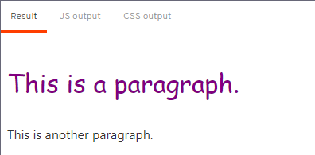

# Svelte Tutorial Notes

**Topics**  
* [Reactivity](./reactivity/readme.md)
* [Props](./props/readme.md)
* [Logic](./logic/readme.md)
* [Events](./events/readme.md)
* [Bindings](./bindings/readme.md)
* [Lifecycle](./lifecycle/readme.md)
* [Stores](./stores/readme.md)
* [Motion](./motion/readme.md)
* [Transitions](./transitions/readme.md)

**Contents**  
* [Adding Data](#adding-data)
* [Dynamic Attributes](#dynamic-attributes)
* [Styling](#styling)
* [Nested Components](#nested-components)
* [HTML Tags](#html-tags)

The following videos do a great job of expressing why Svelte is the next evolution in front-end web development.  

[The Return of 'Write Less, Do More' by Rich Harris](https://youtu.be/BzX4aTRPzno)    

[Rich Harris - Rethinking Reactivity](https://youtu.be/AdNJ3fydeao)

## Adding Data
[Back to Top](#svelte-tutorial-notes)

```svelte
<script>
  let name = 'world';
</script>

<h1>Hello {name}!</h1>
```

## Dynamic Attributes
[Back to Top](#svelte-tutorial-notes)

```svelte
<script>
  let src = 'tutorial/image.gif';
</script>


```

> or (if the property and attribute names are the same)

```svelte

```

## Styling
[Back to Top](#svelte-tutorial-notes)

```svelte
<style>
  p {
    color: purple;
    font-family: 'Comic Sans MS', cursive;
    font-size: 2em;
  }
</style>

<p>This is a paragraph.</p>
```

## Nested Components
[Back to Top](#svelte-tutorial-notes)

Styles do not leak between components.

```svelte
<script>
  import Nested from './Nested.svelte';
</script>

<style>
  p {
    color: purple;
    font-family: 'Comic Sans MS', cursive;
    font-size: 2em;
  }
</style>

<p>This is a paragraph.</p>
<Nested />
```

[](./.images/nested-components.png)

## HTML Tags
[Back to Top](#svelte-tutorial-notes)

> Svelte doesn't perform sanitization before it inserts into the DOM. Manually escape HTML originating from sources you don't trust, otherwise you risk exposing users to XSS attacks.

```svelte
<script>
  let string = `this string contains some <strong>HTML!!!</strong>`;
</script>

<p>{@html string}</p>
```